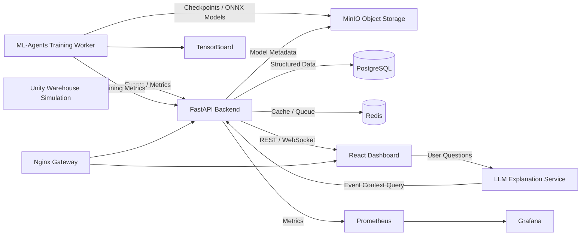
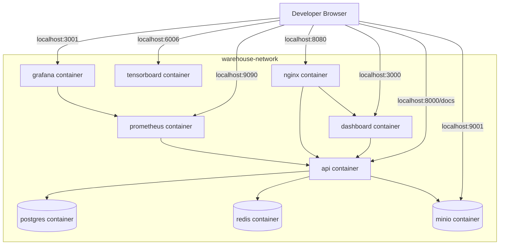
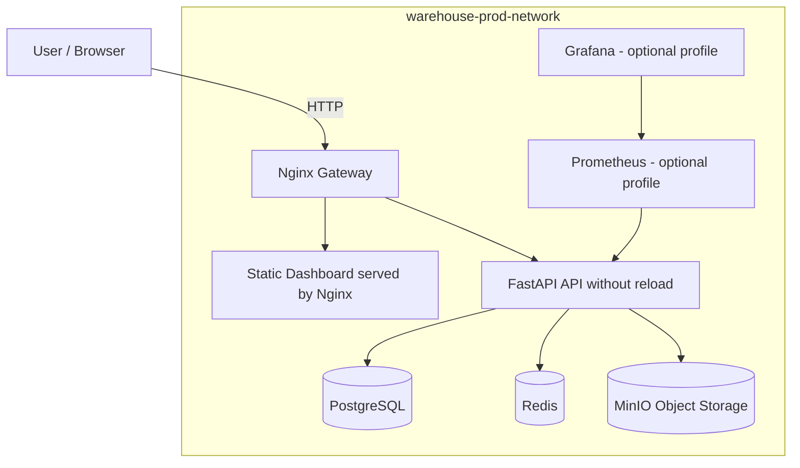

# System Architecture

## Overview

This project is designed as a modular AI engineering system that combines simulation, reinforcement learning, data engineering, backend services, real-time dashboards, Dockerized deployment, and LLM-based explanation.

The system is divided into the following major components:

1. Unity Simulation Environment
2. ML-Agents Training Worker
3. FastAPI Backend
4. PostgreSQL Database
5. Redis Cache / Queue
6. Object Storage for Models and Checkpoints
7. React / Next.js Dashboard
8. LLM Explanation Service
9. Monitoring and Observability Stack
10. Streaming Layer
11. Production-like Nginx Gateway

---

## High-Level Architecture Diagram



---

## Dockerized Development Architecture



---

## Production-Like Architecture



---

## High-Level Data Flow

```text
Unity Simulation
    ↓ event logs / metrics
FastAPI Backend
    ↓ structured persistence
PostgreSQL
    ↓ real-time updates
React Dashboard
    ↓ explanation requests
LLM Explanation Service
```

---

## Training Flow

```text
Unity Environment
    ↓ observations
ML-Agents PPO Trainer
    ↓ trained policy
Checkpoint Files
    ↓ metadata
Model Registry
    ↓ deployment / evaluation
Unity Inference Mode
```

---

## Live Monitoring Flow

```text
Unity Simulation
    ↓ event stream
FastAPI WebSocket
    ↓ live metrics
React Dashboard
```

---

## LLM Explanation Flow

```text
Agent Event Logs
    ↓
FastAPI Query Layer
    ↓
LLM Explanation Service
    ↓
Natural Language Explanation
    ↓
Dashboard
```

---

## Planned Services

| Service | Responsibility |
|---|---|
| api | Core backend service built with FastAPI |
| dashboard | Web dashboard for monitoring and model management |
| llm-service | Explanation service for interpreting robot events |
| postgres | Main relational database |
| redis | Cache and lightweight queue |
| minio | Object storage for checkpoints and model artifacts |
| prometheus | Metrics collection |
| grafana | Monitoring dashboards |
| tensorboard | Training visualization |
| nginx | Reverse proxy and production-like gateway |

---

## Development Modes

The project supports multiple Docker execution modes.

| Mode | Command | Purpose |
|---|---|---|
| Core development | `make up-core` | Runs lightweight local stack |
| Full development | `make up-full` | Runs core services, observability, and training tools |
| Production-like | `make prod-up` | Runs production-like stack with static dashboard and Nginx gateway |

---

## Core Design Principles

- Modular architecture
- Docker-first development
- Reproducible training
- Structured event logging
- Explainable AI layer
- Real-time observability
- Production-oriented deployment
- Clear separation between simulation, training, backend, dashboard, and explanation services
- Development and production-like environment separation
