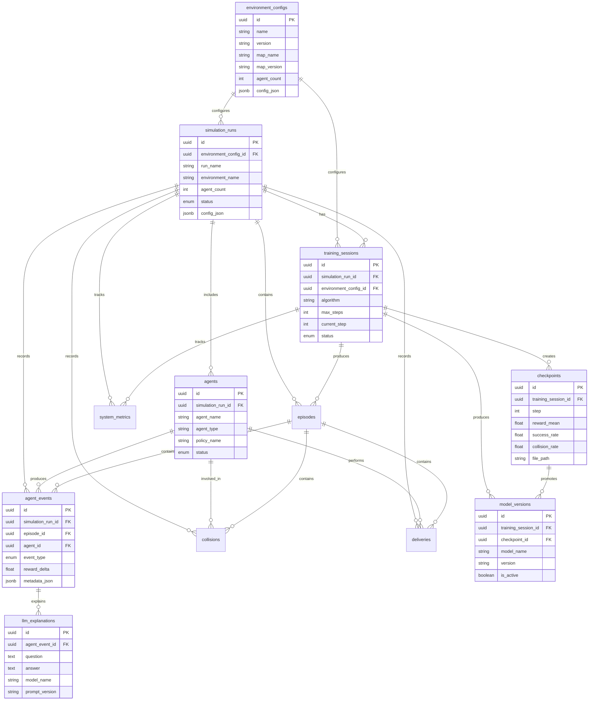

# Database Design

This document will describe the PostgreSQL schema, data model, indexing strategy, migrations, and seed data.

## Planned Core Tables

- simulation_runs
- training_sessions
- episodes
- agents
- agent_events
- collisions
- deliveries
- checkpoints
- model_versions
- environment_configs
- llm_explanations
- system_metrics

## Design Goals

- Structured event logging
- Queryable training history
- Model version tracking
- LLM explanation storage
- Analytics-ready schema
- Migration-based database evolution

---

## Alembic Migration Workflow

The project uses Alembic for database schema migrations.

### Alembic Configuration

Alembic configuration files are located under:

```text
apps/api/alembic.ini
apps/api/alembic/
```

### Check Alembic Setup

```bash
make db-check-alembic
```

### Show Current Migration

```bash
make db-current
```

### Show Migration Heads

```bash
make db-heads
```

### Create a New Migration

```bash
make db-revision MSG="create initial schema"
```

### Apply Migrations

```bash
make db-upgrade
```

### Roll Back the Last Migration

```bash
make db-downgrade
```

### Migration Files

Migration files are stored under:

```text
apps/api/alembic/versions/
```

---

## Alembic Migration Workflow

The project uses Alembic for database schema migrations.

### Alembic Configuration

Alembic configuration files are located under:

```text
apps/api/alembic.ini
apps/api/alembic/
```

### Check Alembic Setup

```bash
make db-check-alembic
```

### Show Current Migration

```bash
make db-current
```

### Show Migration Heads

```bash
make db-heads
```

### Create a New Migration

```bash
make db-revision MSG="create initial schema"
```

### Apply Migrations

```bash
make db-upgrade
```

### Roll Back the Last Migration

```bash
make db-downgrade
```

### Migration Files

Migration files are stored under:

```text
apps/api/alembic/versions/
```

---

## ORM Model Architecture

The database model layer is implemented using SQLAlchemy 2.0 typed ORM models.

### Current ORM Tables

| Table                 | Purpose                                                      |
| --------------------- | ------------------------------------------------------------ |
| `environment_configs` | Stores reusable simulation and training environment settings |
| `simulation_runs`     | Represents Unity simulation executions                       |
| `training_sessions`   | Represents ML-Agents / PPO training sessions                 |
| `episodes`            | Stores reinforcement learning episode-level summaries        |
| `agents`              | Represents robots inside a simulation run                    |
| `agent_events`        | Stores robot movement, decision, reward, and event logs      |
| `collisions`          | Stores collision events                                      |
| `deliveries`          | Stores pickup and delivery task outcomes                     |
| `checkpoints`         | Stores training checkpoint metadata                          |
| `model_versions`      | Stores trained model version metadata                        |
| `llm_explanations`    | Stores LLM-generated explanations for agent events           |
| `system_metrics`      | Stores time-series system and training metrics               |

## Relationship Overview

```text
environment_configs
├── simulation_runs
└── training_sessions

simulation_runs
├── training_sessions
├── episodes
├── agents
├── agent_events
├── collisions
├── deliveries
└── system_metrics

training_sessions
├── episodes
├── checkpoints
├── model_versions
└── system_metrics

agents
├── agent_events
├── collisions
└── deliveries

agent_events
└── llm_explanations

checkpoints
└── model_versions
```

## JSONB Usage

JSONB fields are used for flexible metadata that may vary across simulation, training, and LLM workflows.

Examples include:

- Simulation configuration snapshots
- Unity event payloads
- Training hyperparameter metadata
- Checkpoint artifact metadata
- LLM prompt and context metadata

## Model Metadata Verification

```bash
make db-check-models
```

---

## Initial Schema Migration

The initial database schema is generated from the SQLAlchemy ORM models using Alembic autogeneration.

### Generate the Initial Migration

```bash
make db-revision MSG="create initial database schema"
```

### Apply the Initial Migration

```bash
make db-upgrade
```

### Verify the Current Revision

```bash
make db-current
make db-heads
```

### Verify the Database Schema

```bash
make db-check-schema
```

### Inspect PostgreSQL Tables

```bash
docker compose exec postgres psql -U warehouse_user -d warehouse_ai -c "\dt"
```

### Inspect PostgreSQL Enum Types

```bash
docker compose exec postgres psql -U warehouse_user -d warehouse_ai -c "\dT"
```

## Initial Schema Result

The initial schema creates the following application tables:

- `environment_configs`
- `simulation_runs`
- `training_sessions`
- `episodes`
- `agents`
- `agent_events`
- `collisions`
- `deliveries`
- `checkpoints`
- `model_versions`
- `llm_explanations`
- `system_metrics`

Alembic also creates the following internal table:

- `alembic_version`

## Schema Features

The generated schema includes:

- UUID primary keys
- Foreign key relationships
- PostgreSQL enum types
- JSONB metadata fields
- Indexes
- Unique constraints
- Timestamp fields

## Index Count Note

PostgreSQL automatically creates physical indexes to enforce unique constraints. As a result, database-level index inspection may report more indexes than SQLAlchemy `table.indexes`, which counts only explicitly declared `Index(...)` objects.

This behavior is expected for tables with unique constraints, including:

- `environment_configs`
- `agents`
- `checkpoints`
- `episodes`
- `model_versions`

---

## Seed Data and Synthetic Demo Data

The project includes scripts for inserting baseline seed data and generating synthetic demo data.

### Insert Baseline Seed Data

```bash
make db-seed
```

This clears existing demo data and inserts:

- 1 environment config
- 1 simulation run
- 1 training session
- 3 agents
- 5 episodes
- 50 agent events
- 3 collisions
- 5 deliveries
- 3 checkpoints
- 2 model versions
- 3 LLM explanations
- 20 system metrics

### Generate Additional Synthetic Demo Data

```bash
make db-generate-demo-data
```

This appends an additional generated dataset with:

- 1 environment config
- 1 simulation run
- 1 training session
- 5 agents
- 10 episodes
- 200 agent events
- 8 collisions
- 20 deliveries
- 4 checkpoints
- 2 model versions
- 5 LLM explanations
- 50 system metrics

### Verify Seed Data

```bash
make db-check-data
```

### Show Table Counts

```bash
make db-table-counts
```

Seed and demo data are intended for local development, dashboard testing, API development, and database validation.

---

# Database ERD

The following ERD summarizes the core relational model.



---

# Backup and Restore

The project includes local PostgreSQL backup and restore scripts for development and verification workflows.

## Create a Backup

```bash
make db-backup
```

This command creates a timestamped SQL backup under:

```text
backups/
```

Example:

```text
backups/warehouse_ai_20260701_184500.sql
```

Backup files are intentionally ignored by Git.

## Restore a Backup

```bash
make db-restore BACKUP=backups/warehouse_ai_YYYYMMDD_HHMMSS.sql
```

The backup is created using the following `pg_dump` options:

```text
--clean
--if-exists
--no-owner
--no-privileges
```

These options make local restoration safer and more portable across development environments.

---

# Final Database Verification

Run the complete database verification workflow:

```bash
make db-verify
```

This command verifies:

- PostgreSQL connection
- SQLAlchemy model metadata
- Alembic configuration
- Database schema
- Seed and demo data
- Table counts
