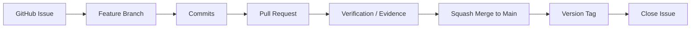

# Project Management

## Overview

This project follows a phase-based engineering workflow. Each major phase is tracked through GitHub Issues, implemented through feature branches, reviewed through Pull Requests, and released through Git tags.

## Repository

```text
sudenazcaglar/warehouse-ai-simulator
```

## Project Workflow



## Branch Strategy

The project uses a simple and professional branch strategy.

| Branch Type | Example | Purpose |
|---|---|---|
| Main branch | main | Stable project history |
| Feature branch | feature/phase-2-docker-foundation | Phase or feature implementation |
| Polish branch | feature/phase-1-2-polish | Documentation and quality improvements |

## Pull Request Strategy

Each meaningful phase or sub-phase is completed through a Pull Request.

Pull Requests should include:

- Summary of changes
- Added components
- Verification steps
- Evidence document references
- Related issue reference

## Release Tag Strategy

The project uses semantic milestone tags.

| Tag | Purpose |
|---|---|
| v0.1-project-foundation | Project foundation |
| v0.2-dockerized-foundation | Initial Dockerized environment |
| v0.2.1-docker-workflow | Makefile and health workflow |
| v0.2.2-compose-profiles | Compose profiles and production-like setup |

## Issue Tracking

GitHub Issues are used as the project board for now.

Current phase issues:

- Phase 1: Project Foundation
- Phase 2: Dockerized Development Foundation
- Phase 3: Professional PostgreSQL Database Architecture
- Phase 4: FastAPI Backend Foundation

Closed phase issues indicate completed milestones. Open phase issues indicate active or upcoming work.

## Evidence-Based Development

Each major phase includes evidence documentation under:

```text
docs/evidence/
```

Evidence documents record:

- Commands executed
- Service health results
- Docker Compose status
- Production-like verification
- Phase completion notes

## Current Status

Completed:

- Phase 1: Project Foundation
- Phase 2: Dockerized Development Foundation

Next:

- Phase 3: Professional PostgreSQL Database Architecture
- Phase 4: FastAPI Backend Foundation
